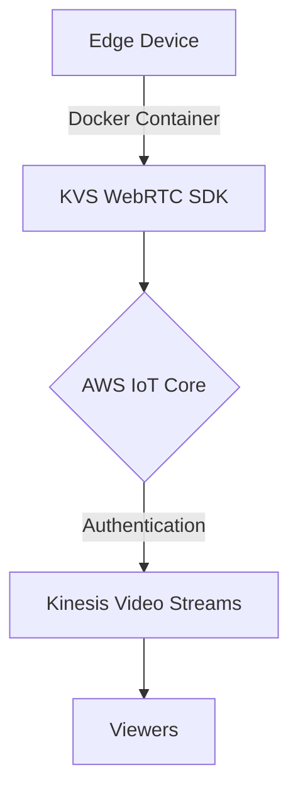

# Dockerized AWS KVS WebRTC C SDK

[](https://opensource.org/licenses/Apache-2.0)

[](https://www.docker.com/)
[](https://aws.amazon.com/)

This repository provides a Dockerized version of the AWS Kinesis Video Streams (KVS) WebRTC C SDK integrated with GStreamer. It allows users to stream video/audio to AWS KVS WebRTC, using customizable pipelines for different sources (e.g., USB cameras, IP cameras).

## Contents

- [Features](#features)
- [Quick Start](#quick-start)
- [Prerequisites](#prerequisites)
- [Configuration](#configuration)
- [Usage](#usage)
- [Docker Hub Image](#docker-hub-image)
- [Architecture](#architecture)
- [Troubleshooting](#troubleshooting)
- [Contributing](#contributing)
- [License](#license)

## Features

- **Containerized Environment**: Ensures consistent build and runtime across platforms
- **AWS KVS WebRTC Integration**: Low-latency, real-time video/audio streaming
- **GStreamer Pipeline Support**: Flexible video/audio capture and encoding options
- **IoT Core Authentication**: Secure device-to-cloud communication
- **Multi-arch Support**: x86_64 and ARM64 compatibility
- **Optimized for Edge Devices**: Efficient resource utilization

## Quick Start

1. Clone the repository:
   ```sh
   git clone https://github.com/sudoping01/aws-kvs-webrtc-stream-dockerised
   cd aws-kvs-webrtc-stream-dockerised
   ```

2. Configure AWS credentials:
   ```sh
   cp certs/config.yaml.template certs/config.yaml
   # Edit certs/config.yaml with your AWS IoT credentials
   ```

3. Build and run:
   ```sh
   docker-compose up --build
   ```

## Prerequisites

- Docker 20.10.0+
- Docker Compose 1.29.0+
- AWS Account with KVS and IoT Core access
- IoT Core device certificates

## Configuration

### AWS Setup

1. Create a Kinesis Video Stream in your AWS Console
2. Register an IoT thing and download certificates
3. Create an IoT Role Alias for KVS access

### Local Setup

1. Place IoT certificates in `certs/`:
   - `thing.cert.pem`
   - `thing.private.key`
   - `AmazonRootCA1.pem`
   

2. Configure `certs/config.yaml`:
   ```yaml
   endpoint: <iot-endpoint>
   credentialEndpoint: <credential-endpoint> 
   thingName: <your-thing-name> 
   roleAlias: <your-role-alias> 
   rootCAFile: <your-root-ca-file> #AmazonRootCA1.pem
   certFile: <your-thing-cert-file> #thing.cert.pem 
   privateKeyFile: <your-private-key-file> #thing.private.key
   ```

3. Adjust `docker-compose.yml` for your use case:
   ```yaml
   environment:
     - AWS_DEFAULT_REGION=your_aws_region # if not set, the default is us-west-2 
     - CHANNEL_NAME=your_channel_name
     - PIPELINE=your_gstreamer_pipeline
   ```
4. Example of `gst pipeline`: 
    - camera usb :

        ```text
        v4l2src do-timestamp=TRUE device=/dev/video0 ! queue ! videoconvert ! video/x-raw,width=640,height=480,framerate=30/1 ! x264enc bframes=0 speed-preset=veryfast bitrate=512 byte-stream=true tune=zerolatency ! video/x-h264,stream-format=byte-stream,alignment=au,profile=baseline ! appsink sync=TRUE emit-signals=TRUE name=appsink-video
        ```
    - ip camera (brand IMOU):

         ```text
         rtspsrc location=rtsp://<user>:<password>@<ip>:554/cam/realmonitor?channel=1&subtype=1&unicast=false&proto=Onvif latency=0 short-header=TRUE ! rtph264depay !video/x-h264,stream-format=byte-stream,alignment=au,profile=baseline ! appsink sync=TRUE emit-signals=TRUE name=appsink-video
         ```

## Usage

### Starting the Stream

```sh
docker-compose up
```

### Viewing the Stream

1. Open the [KVS Console](https://console.aws.amazon.com/kinesisvideo)
2. Select your stream
3. Click "Start playback"

### Stopping the Stream

```sh
docker-compose down
```

## Docker Hub Image

We provide a pre-built Docker image on Docker Hub for convenience. You can pull and use this image instead of building it locally:

```sh
docker pull sudoping01/aws-kvs-webrtc-stream:latest
```

To run the container using the Docker Hub image:

```sh
docker run -it --device=/dev/video0 \
  -v /path/to/your/certs:/certs \
  -v /path/to/your/config.yaml:/certs/config.yaml \
  -e AWS_DEFAULT_REGION=your_aws_region \
  -e CHANNEL_NAME=your_channel_name \
  -e PIPELINE="your_gstreamer_pipeline" \
  sudoping01/aws-kvs-webrtc-stream:latest
```

For more information about using the Docker Hub image, including configuration details and examples, please visit our [Docker Hub page](https://hub.docker.com/r/sudoping01/aws-kvs-webrtc-stream).

## Architecture



Our solution encapsulates the KVS WebRTC SDK in a Docker container, leveraging IoT Core for secure authentication with AWS services.

## Troubleshooting

| Issue | Solution |
|-------|----------|
| Connection Failure | Verify AWS credentials and IoT certificates |
| No Video | Check GStreamer pipeline and video device availability |
| Poor Quality | Adjust bitrate and resolution in GStreamer pipeline |

For detailed logs:
```sh
docker-compose logs -f
```

## Contributing

We welcome contributions! Please follow these steps:

1. Fork the repository
2. Create a feature branch: `git checkout -b feature/NewFeature`
3. Commit changes: `git commit -am 'Add NewFeature'`
4. Push to the branch: `git push origin feature/NewFeature`
5. Submit a pull request

## License

This project is licensed under the MIT License - see the [LICENSE](LICENSE) file for details.

---
